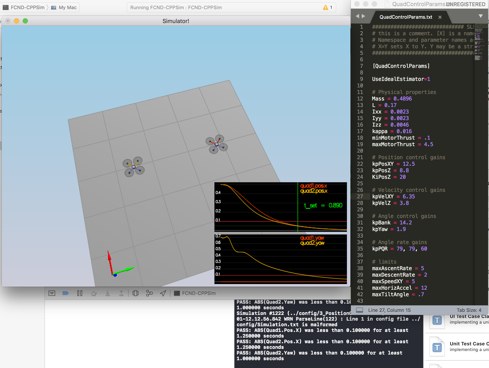

## Project: 3D Motion Planning


---


### Implemented body rate control in C++

#### The controller should be a proportional controller on body rates to commanded moments. The controller should take into account the moments of inertia of the drone when calculating the commanded moments.
```cpp
  V3F errPQR = pqrCmd - pqr;
    
    momentCmd.x = Ixx * kpPQR[0] * errPQR[0];
    momentCmd.y = Iyy * kpPQR[1] * errPQR[1];
    momentCmd.z = Izz * kpPQR[2] * errPQR[2];
```

### Implement roll pitch control in C++.

#### The controller should use the acceleration and thrust commands, in addition to the vehicle attitude to output a body rate command. The controller should account for the non-linear transformation from local accelerations to body rates. Note that the drone's mass should be accounted for when calculating the target angles.

```cpp
    float c = - collThrustCmd / mass;
    
    if (collThrustCmd > 0.0)
    {
        float bcmdX_R13 = CONSTRAIN(accelCmd.x / c, - maxTiltAngle, maxTiltAngle);
        float bcmdY_R23 = CONSTRAIN(accelCmd.y / c, - maxTiltAngle, maxTiltAngle);
        
        float bX_act = R(0,2);
        float bY_act = R(1,2);
        float bcmdX_dot = kpBank * (bcmdX_R13 - bX_act);
        float bcmdY_dot = kpBank * (bcmdY_R23 - bY_act);
        
        pqrCmd.x = (R(1,0) * bcmdX_dot - R(0,0) * bcmdY_dot) / R(2,2);
        pqrCmd.y = (R(1,1) * bcmdX_dot - R(0,1) * bcmdY_dot) / R(2,2);
    }
    else
    {
        pqrCmd.x = 0.f;
        pqrCmd.y = 0.f;
    }
        pqrCmd.z = 0.f;
```

### Implement altitude controller in C++

#### The controller should use both the down position and the down velocity to command thrust. Ensure that the output value is indeed thrust (the drone's mass needs to be accounted for) and that the thrust includes the non-linear effects from non-zero roll/pitch angles.
Additionally, the C++ altitude controller should contain an integrator to handle the weight non-idealities presented in scenario 4

```cpp
    float z_dot_cmd = kpPosZ * (posZCmd - posZ) + velZCmd;
    z_dot_cmd = CONSTRAIN(z_dot_cmd, -maxAscentRate, maxDescentRate);
    integratedAltitudeError += (posZCmd - posZ) * dt;
    float u1_bar = kpVelZ * (z_dot_cmd - velZ) + KiPosZ * integratedAltitudeError + accelZCmd;
    thrust = - mass * (u1_bar - 9.81f) / R(2,2);
```

### Implement lateral position control in C++.

#### The controller should use the local NE position and velocity to generate a commanded local acceleration

```cpp
    if (velCmd.magXY() > maxSpeedXY)
    {
        velCmd = velCmd * maxSpeedXY / velCmd.magXY();
    }
    V3F acc_p_term = kpPosXY * (posCmd - pos);
    V3F acc_v_term = kpVelXY * (velCmd - vel);
    accelCmd = acc_p_term + acc_v_term + accelCmdFF;
    
    if (accelCmd.magXY() > maxAccelXY)
    {
        accelCmd *= maxAccelXY / accelCmd.magXY();
    }
```

### Implement yaw control in C++.

#### The controller can be a linear/proportional heading controller to yaw rate commands (non-linear transformation not required).

```cpp
    yawCmd = fmodf(yawCmd, F_PI);
    float yaw_err = yawCmd - yaw;
    if (yaw_err > F_PI)
    {
        yaw_err -= 2 * F_PI;
    }
    else if (yaw_err < - F_PI)
    {
        yaw_err += 2 * F_PI;
    }
    yawRateCmd = kpYaw * yaw_err;
```

### Implement calculating the motor commands given commanded thrust and moments in C++.

#### The thrust and moments should be converted to the appropriate 4 different desired thrust forces for the moments. Ensure that the dimensions of the drone are properly accounted for when calculating thrust from moments.

```cpp
    float omega_sqr[4];
    float lx = L * cos(M_PI_4);
    float ly = L * sin(M_PI_4);
    float c_bar = collThrustCmd;
    float p_bar = momentCmd.x / lx;
    float q_bar = momentCmd.y / ly;
    float r_bar = - momentCmd.z / kappa;

    omega_sqr[0] = (c_bar + p_bar + r_bar + q_bar) / 4.f;
    omega_sqr[1] = (c_bar - p_bar - r_bar + q_bar) / 4.f;
    omega_sqr[3] = (c_bar - p_bar + r_bar - q_bar) / 4.f;
    omega_sqr[2] = (c_bar + p_bar - r_bar - q_bar) / 4.f;

    cmd.desiredThrustsN[0] = omega_sqr[0];
    cmd.desiredThrustsN[1] = omega_sqr[1]; // front right
    cmd.desiredThrustsN[2] = omega_sqr[2]; // rear left
    cmd.desiredThrustsN[3] = omega_sqr[3]; // rear rightt
```

### Your C++ controller is successfully able to fly the provided test trajectory and visually passes inspection of the scenarios leading up to the test trajectory.

#### Ensure that in each scenario the drone looks stable and performs the required task. Specifically check that the student's controller is able to handle the non-linearities of scenario 4 (all three drones in the scenario should be able to perform the required task with the same control gains used).

- [x] Attitude Control Scenario:


- [x] Position Control Scenario: 


- [x] Nonidealities: 


- [x] Trajectory Following:


# Extra Challenges: 

`FigureEightFF.txt` is provided with velocity and acceleration information. Though passing all the tests, I still can't reach the smooth Quad2 behavior from ProjectReadme :confused:

