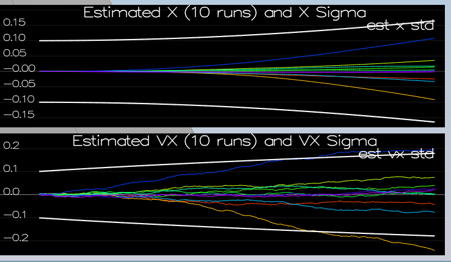
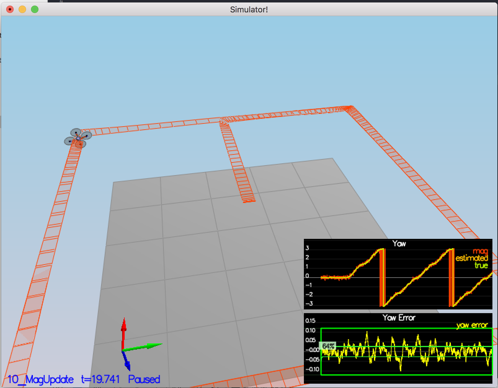
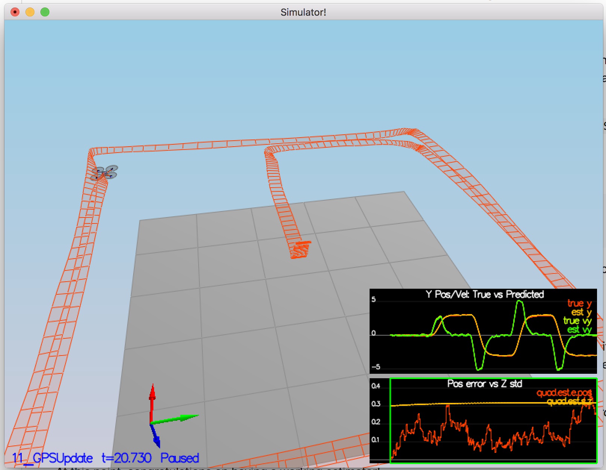
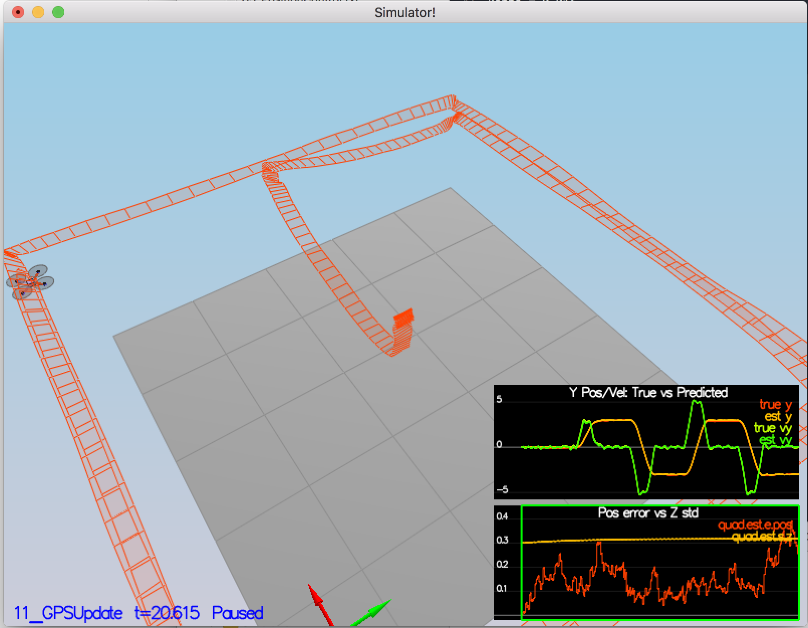

## Project: Building an Estimator

---
*[x, y, z, x_dot, y_dot, z_dot, yaw]* - EKF
*[p, q, r]* - Gyro measurements 
*[roll, pitch]* - Complementary Filter

*u = [xddot_Bfr, yddot_Bfr, zddot_Bfr, yaw_dot]* 
As control input use Accelerometer -> [xddot_Bfr, yddot_Bfr, zddot_Bfr]
                    Rate Gyro -> yaw_dot
                    
### Determine the standard deviation of the measurement noise of both GPS X data and Accelerometer X data.

#### The calculated standard deviation should correctly capture  of approximately 68% the sensor measurements. Your writeup should describe the method used for determining the standard deviation given the simulated sensor measurements.

1. Used pandas library to get sample standard deviation over requested axis. (`ExtractingStd.py`):

```python

    def find_std(csv_name):
        df = pd.read_csv(csv_name, delimiter = ',', header = 0, usecols = [1], parse_dates=True)
        data_std = df.std()
        return data_std
```    
  
Quad.GPS.X   | Quad.IMU.AX 
-------------|-------------   
0.717478     |  0.511142

### Implement a better rate gyro attitude integration scheme in the UpdateFromIMU() function.

#### The improved integration scheme should result in an attitude estimator of < 0.1 rad for each of the Euler angles for a duration of at least 3 seconds during the simulation. The integration scheme should use quaternions to improve performance over the current simple integration scheme.

1. Improve a complementary filter-type attitude filter by replacing a small-angle approximation integration method, so that the current attitude estimate (rollEst, pitchEst and ekfState(6)) are used to integrate the body rates (`p = gyro.x`, `q = gyro.y`) into new Euler angles - nonlinear complementary filter.

    1. use the `Quaternion` class, which has a `FromEuler123_RPY` function for creating an attitude `attEst` quaternion from Euler Roll/Pitch\Yaw. 
    2. Quaternion function `IntegrateBodyRate_fast` defines dq to be the quaternion that consists of the measurement of the angular rates from the IMU in the body frame (`p = gyro.x`, `q = gyro.y`, `r = gyro.z`),and give a predicted quaternion, `predictedQt = dq * qt`
    3. Extract predicted roll, pitch, yaw.

```cpp
Quaternion<float> attEst = Quaternion<float>::FromEuler123_RPY(rollEst, pitchEst, ekfState(6));
Quaternion<float> predictedQt = attEst.IntegrateBodyRate_fast(gyro.x, gyro.y, gyro.z, dtIMU / 2.f);
float predictedPitch = predictedQt.Pitch();
float predictedRoll = predictedQt.Roll();
ekfState(6) = predictedQt.Yaw();
```

	2. The integrated (predicted) value is then updated in a complementary filter style with attitude information from accelerometers
	
**???*** Why use 
```cpp
    accelPitch = atan2f(-accel.x, 9.81f);
```
instead of 
```cpp
    accelPitch = asinf(accel.x, 9.81f);
```
???

### Implement all of the elements of the prediction step for the estimator.

#### The prediction step should include the state update element (`PredictState()` function), a correct calculation of the Rgb prime matrix, and a proper update of the state covariance. The acceleration should be accounted for as a command in the calculation of gPrime. The covariance update should follow the classic EKF update equation.

1. `PredictState()`. mu_t_predict = g(mu_prev, u_t), 
g - transition function

	1. dt is on the order of 1ms, so simplistic integration methods are fine here
	2.  Attitude Quaternion  - current vehicle state with (phi, theta, psi)

```cpp
 Quaternion<float> attitude = Quaternion<float>::FromEuler123_RPY(rollEst, pitchEst, curState(6));
```

3. attitude.Rotate_BtoI(<V3F>) to rotate a vector from body frame to inertial frame (accel and gyro)

```cpp
	V3F accel_Ifr = attitude.Rotate_BtoI(accel);
	V3F gyro_Ifr = attitude.Rotate_BtoI(gyro);
```

4. The yaw integral is already done in the IMU update. 

```cpp
	predictedState[0] = curState[0] + curState[3] * dt; // x_pred = x_t + xdot_t * dt
	predictedState[1] = curState[1] + curState[4] * dt; // y_pred = y_t + ydot_t * dt
	predictedState[2] = curState[2] + curState[5] * dt; // z_pred = z_t + zdot_t * dt
	predictedState[3] = curState[3] + accel_Ifr.x * dt; // xdot_pred = xdot_t + xddot_t * dt
	predictedState[4] = curState[4] + accel_Ifr.y * dt; // ydot_pred = ydot_t + yddot_t * dt
	predictedState[5] = curState[5] - 9.81f * dt + accel_Ifr.z * dt; // zdot_pred = zdot_t + zddot_t * dt
	predictedState[6] = gyro_Ifr.z;
```

2. In QuadEstimatorEKF.cpp, calculate the partial derivative of the body-to-global rotation matrix in the function GetRbgPrime(). 
	
```cpp
    RbgPrime(0,0) = - cos(pitch) * sin(yaw);
    RbgPrime(0,1) = - sin(roll) * sin(pitch) * sin(yaw) - cos(roll) * cos(yaw);
    RbgPrime(0,2) = - cos(roll) * sin(pitch) * sin(yaw) + sin(roll) * cos(yaw);
    RbgPrime(1,0) = cos(pitch) * cos(yaw);
    RbgPrime(1,1) = sin(roll) * sin(pitch) * cos(yaw) - cos(roll) * sin(yaw);
    RbgPrime(1,2) = cos(roll) * sin(pitch) * cos(yaw) + sin(roll) * sin(yaw);
    RbgPrime(2,0) = 0.f;
    RbgPrime(2,1) = 0.f;
    RbgPrime(2,2) = 0.f;
```	
	
3. Predict the state covariance forward in `Predict()`.
	1. Cov_t_predict = g_prime_t * Cov_prev * g_prime_t.T + Q_t,  motion model noise = Norm(0, Q), the transition model covariance, Q, is loaded up from a parameter file in member variable Q
	2. Current estimated attitude in variables rollEst, pitchEst, state(6)
	3. The transition Jacobian g_prime

```cpp
  MatrixXf gPrime(QUAD_EKF_NUM_STATES, QUAD_EKF_NUM_STATES);
  gPrime.setIdentity();

  gPrime(0, 3) = dt;
  gPrime(1, 4) = dt;
  gPrime(2, 5) = dt;
  gPrime(3, 6) = (RbgPrime(0, 0) * accel.x + RbgPrime(0, 1) * accel.y + RbgPrime(0, 2) * accel.y) * dt;
  gPrime(4, 6) = (RbgPrime(1, 0) * accel.x + RbgPrime(1, 1) * accel.y + RbgPrime(1, 2) * accel.y) * dt;
  gPrime(5, 6) = (RbgPrime(2, 0) * accel.x + RbgPrime(2, 1) * accel.y + RbgPrime(2, 2) * accel.y) * dt;

  ekfCov = gPrime * ekfCov * gPrime.transpose() + Q;
```	
		
4. Tune the QPosXYStd and the QVelXYStd process parameters in QuadEstimatorEKF.txt to try to capture the magnitude of the error 

QPosXYStd | QVelXYStd
----------|----------
0.02	  | 0.15




### Implement the magnetometer update.

#### The update should properly include the magnetometer data into the state. Note that the solution should make sure to correctly measure the angle error between the current state and the magnetometer value (error should be the short way around, not the long way).

1. Tune the parameter QYawStd (QuadEstimatorEKF.txt) for the QuadEstimatorEKF so that it approximately captures the magnitude of the drift
*QYawStd = 0.07*



2. Implement magnetometer update in the function `UpdateFromMag()`

```cpp
  hPrime(QUAD_EKF_NUM_STATES - 1) = 1.f;
  zFromX(0) = ekfState[6];
  float dYaw = z(0) - zFromX(0);
  if (dYaw > F_PI) z(0) -= 2.f*F_PI;
  if (dYaw < -F_PI) z(0) += 2.f*F_PI;
```

### Implement the GPS update.

#### The estimator should correctly incorporate the GPS information to update the current state estimate.

```cpp
    for (int i = 0; i < z.size(); i++)
    {
        hPrime(i, i) = 1.f;
    }
    zFromX << ekfState[0], ekfState[1], ekfState[2], ekfState[3], ekfState[4], ekfState[5];
```



### De-tune your controller to successfully fly the final desired box trajectory with your estimator and realistic sensors.

#### The controller developed in the previous project should be de-tuned to successfully meet the performance criteria of the final scenario (<1m error for entire box flight).

1. Replaced `QuadController.cpp` with the controller from the last project.

2. Replaced `QuadControlParams.txt` with the control parameters from the last project. Quad collapsed immediately :)

3. The main reason turned to be overtuned kpPQR.z and undertuned kiPosZ



